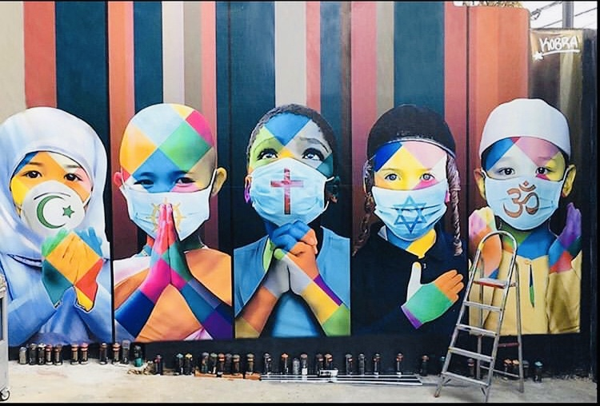

import Counter from "../../components/counter.js"

<h1>How we can all help during Covid-19</h1>

During the crisis of COVID-19, all humans are being impacted by some measure. Something interesting to think about is how people are being impacted. This article hopes to articulate this thought.

The first wave of people being or have been impacted are the lives we have lost. These lives are the ones we must always honor and remember. To dive in deeper into this new word of "wave", we can think about the elderly. Nursing homes have seen a surge in deaths. The federal government has not released a count of its own but Associated Press has been keeping a tally based on media reports and state health departments. The latest count is at 3,621 which was just 450 10 days ago according to a report by Times. 

 Alone in nursing homes, there have been over 2200 lost lives and these are just the outbreaks we know about. Most states provide only total numbers of nursing home lost ones. They do no give out specific details of the outbreak. This leads to conclusion that the reality for many of these places could be much worse.

 The second "wave" of people are the ones who are fighting currently. A recent article by The New York Times offers some hope. It talks about hope for the maternity ward in brooklyn fighting covid-19. Nearly 200 babies have arrived since march and some of the pregnant women have fallen extremely ill. According to the article, A 31-year old pregnant women with lungs ravaged by coronavirus, hooked up to a ventilator, neither her or her child getting enough air with only chance of being saved included doctors delivering her baby. But this would be two months before the due date, and the infant could be born with preliminary health issues while the mother herself is fighting coronavirus. Doctors are hopeful for these battles however, since not one mother or baby has been lost. There have been no confirmed cases among newborns, though doctors are awaiting results for one, according to the chair of pediatrics, Dr. Noah Kondamudi.

The ones who are helping during these times  include the health care providers. According to an article by US News, states are not consistently tracking health care workers infected with coronavirus and staff shortages could be coming. It is unclear of how many are falling and ill and whether current hospital measures are adequately protecting the staff from the virus. "It's obviously great that we're getting the ventilators, but you still need respiratory therapists to manage those ventilators, and you need nurses and techs to be there to care for the patients," quoted by Dr. James Williams in Texas in a US News article. 

As supplies grow scares, this will increase the likelihood of infections among health care workers which can lead to a shortage of the very people needed to heal the ill. 

This is a developing story with more contributions that will be added. Currently it has not been released yet

Sources:

<a href="https://time.com/5819859/us-nursing-home-deaths/ ">US Nursing Home Deaths</a>
<br />
 <a href="https://www.usnews.com/news/national-news/articles/2020-04-03/how-many-health-care-workers-have-coronavirus" target="_blank">Health care workers impacted </a>
 <a href="https://www.nytimes.com/2020/04/12/nyregion/coronavirus-births-mothers.html">US Birth Mothers</a>
<br />
<div className="code"> 
</div>


<!-- `<h1>heading one</h1>` -->


<div className="code">

```javascript
const name = "Fahad Kiani"
```

</div>

<div className="post-image">



</div>

<div className="code"> </div>

<Counter />