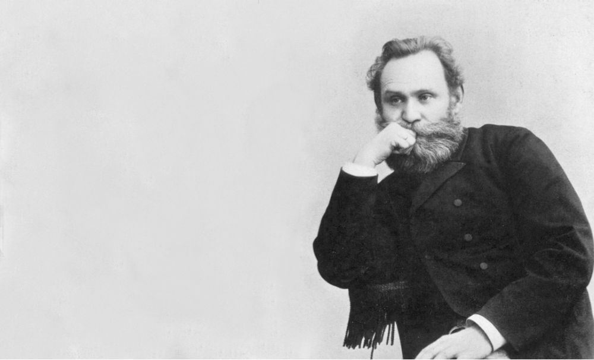
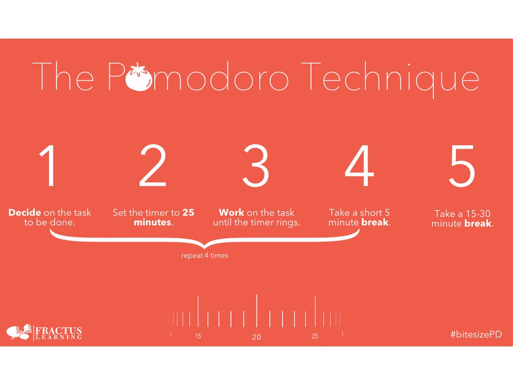

import Counter from "../../components/counter.js"

<h1>How to be more productive with Pomodoro Technique</h1>

The Pomodoro Technique is a time management method developed by Francesco Cirillo in the late 1980s. The technique uses a timer to break down work into intervals, traditionally 25 minutes, followed by short breaks. 


# You work for 25 minutes, then take a break for five minutes Each 25-minute work period is called a "pomodoro", Italian word for tomato.


<div className="post-image">


</div>

 Pomodoro technique works well because it helps you fight the urge from switching gears to work on another task. It keeps you focused on one task for that time being. It also helps you break down your task into subtasks. Completing subtasks ultimately help you complete your main task.

<h1>Scientifically Proven </h1>

<div className="post-image">



</div>

The famous Pavlovian theory pointed that events or objects triggered conditional responses. For example, when consumers hear the word "sale", they develop the urge to shop, even if people have no specific need at the time. The same concept applies to our work habits. When we think of "work", we think of breaks, we think of distractions and we think of all other things that are not related to that certain task we are trying to accomplish.  

# When we are working on a task there are multiple thoughts that are coming inside our mind. There are urges for us to check our phones, work on another task, take a break, etc. The reason why pomodoro technique works well is that it gives us the discipline to focus on one task or subtask. 


<br></br>

# According to research, It takes an average of about 25 minutes to return to the original task after an interruption

<br></br>

<h1>Solution!</h1>

<div className="post-image">



</div>


<h1 style="text-decoration: underline;"> How to get started, overcome distractions and build productivity screen time </h1>

<p style="text-align: center; padding: 0;">

1) <a href="https://apps.apple.com/us/app/focus-keeper-time-management/id867374917" target="_blank"> Download iOS app</a>

2) Write down a main task that you set to finish (Ex. Building a Website)

2) Start the timer, keep it running visibly. It will build your screen time.  

3) Complete a subtask relating to your main task within each cycle (Ex. Drawing out the flow of the website)

4) Take a 5 minute beak after each cycle

5) Repeat, continue finishing your subtasks it will lead you to finish your main task! 

</p>

<div className="post-image">


</div>

<div className="code">


```javascript
const name = "productivity"
```

</div>

<Counter/>