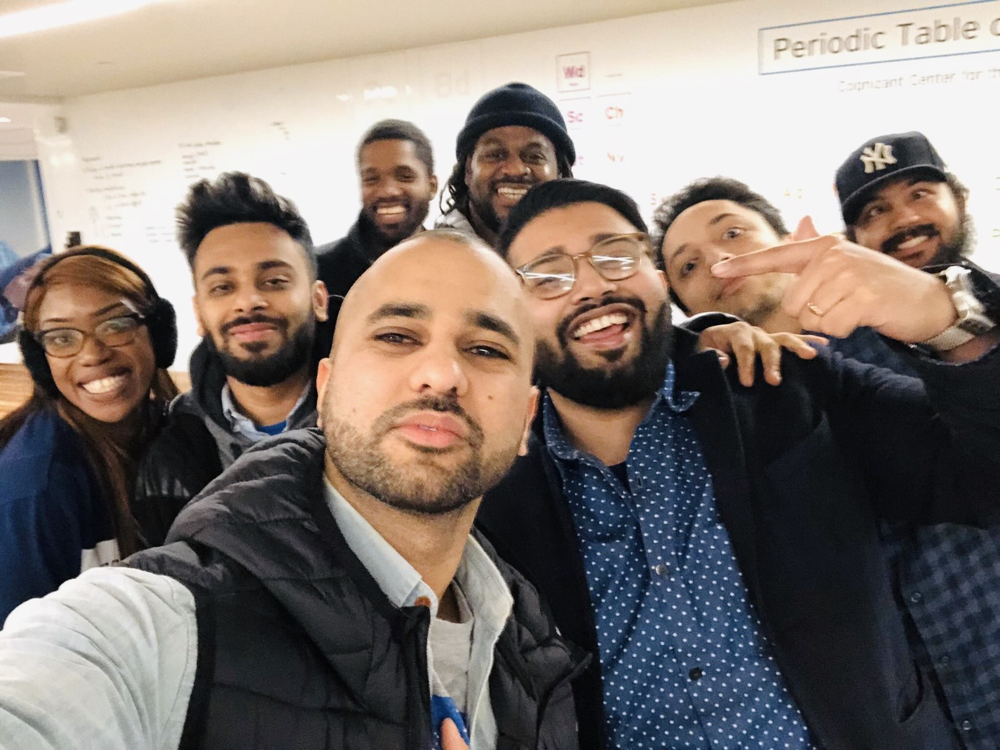

import Counter from "../../components/counter.js"

<h1>Made in the bronx</h1>

Friday 4/17/2020 will mark the Graduation Ceremony of five graduating classes from Per Scholas. Not too long ago, I remember walking into the building telling myself "I can do this, I can do this, I can do this" every day when I would enter and leave.

Our Software Engineering cohort started with our 20 students and towards the end, we had only about 10 remaining.Uncertain predicament and circumstances challenged us in every way possible. I still remember having various conversations with students from different backgrounds. Some had college degrees and jobs while others didn't. Some had a place they called home, and others didn't. Some had the luxury of being able to eat breakfast, lunch, and dinner, and others didn't.

Despite the background, everyone shared the same vision for the future. We all wanted to become better. I never took these conversations for granted because they carried me through when I would tell myself "I can do this, I can do this, I can do this". I would think about all my other fellow students who might just have it more challenging than I do.

As we approach our graduation, I wanted to share these reflections. If you find yourself in doubtful thoughts, reflect back on the very initial stages of this journey and how far you have come.

For anyone else that has been impacted by the current circumstances in the job market and looking to build their tech skills, open-source in technology is a beautiful thing. It is designed on a principle around "Hey I figured it out, you are welcome to use my solution. Maybe you can figure it out better than I can".

Per Scholas also offers technical training from various courses at no cost. This non-profit based out of the Bronx has helped many students from various backgrounds. The Bronx is also one of the neighborhoods that are being impacted by the spread of Covid-19 the hardest. Keep the neighborhood and its people in your prayers.

God bless the world and us the people.


Fahad J. Kiani


<div className="code">

```javascript
const name = "test"
```
</div>


<div className="post-image">




<a href="https://perscholas.org/" target="_blank">Learn about Per Scholas</a>


</div>


<Counter />